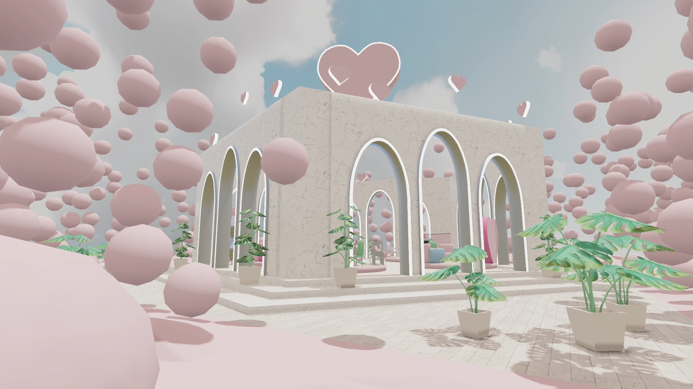

# Decentraland scene

This project contains Valentines Day scene created for Sandstorm's Decentraland contest #12 - Temple of Love.

Currently deployed under Decentraland name `Shiny`. Follow [this link](https://play.decentraland.org/?realm=shiny.dcl.eth) or type in the Decentraland chatbox `/changerealm shiny.dcl.eth` to visit the scene. This scene is built with the SDK7.

Skyboxes generated using Blockade Labs [Skybox AI tool](https://skybox.blockadelabs.com/) licensed under the [CC BY 4.0 license](https://creativecommons.org/licenses/by/4.0/)




## 3D models

All of the 3D models have been created by me, except Github and Twitter links, which are from Decentraland Builder.

Textures used in 3D models and their sources:

- Color palette from Decentraland builder
- Light marble for building: [ambientCG](https://ambientcg.com/view?id=Marble019). AmbientCG has a nice selection of textures under [Creative Commons CC0 1.0 Universal License](https://docs.ambientcg.com/license/)
- Light pavement for ground:[ambientCG](https://ambientcg.com/view?id=PavingStones125A)
- Light fabric (carpet) for platforms: [ambientCG](https://ambientcg.com/view?id=Fabric062)
- Dark marble for building: [ambientCG](https://ambientcg.com/view?id=Marble016)
- Dark pavement for ground: [ambientCG](https://ambientcg.com/view?id=Tiles045)
- Dark fabric (carpet) for platforms: [ambientCG](https://ambientcg.com/view?id=Fabric042)
- Images used as textures for plant leaves, keyboard, cookies and flowers generated using Midjourney AI

## Try it out

1. Download this repository.

2. Install the [Decentraland Editor](https://docs.decentraland.org/creator/development-guide/sdk7/editor/)

3. Open a Visual Studio Code window on this scene's root folder. Not on the root folder of the whole repo, but instead on this sub-folder that belongs to the scene.

4. Open the Decentraland Editor tab, and press **Run Scene**

Alternatively, you can use the command line. Inside this scene root directory run:

```
npm i
npm run start
```

## Copyright info

This scene is protected with a standard Apache 2 licence. See the terms and conditions in the [LICENSE](/LICENSE) file.
